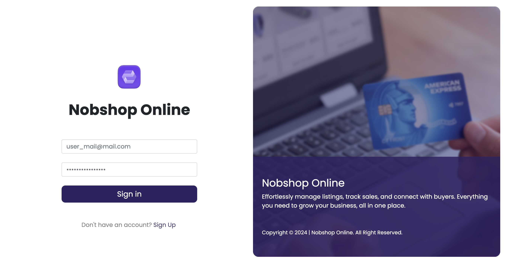

# Nobshop Online Login/Register Sample Pages

A simple, responsive login page implementation using Blazor and Bootstrap 5. This project serves as a demonstration of building modern UI components with Blazor.

## Preview

## Features

- Responsive login interface
- Split-screen design
- Bootstrap 5 integration
- Interactive form elements
- Navigation to registration page

## Technologies Used

- Blazor
- Bootstrap 5
- HTML/CSS

## 📝 Project Structure

- `Components/Pages/Login.razor` - Main login page component
- `wwwroot/images/` - Contains logo and illustration assets
